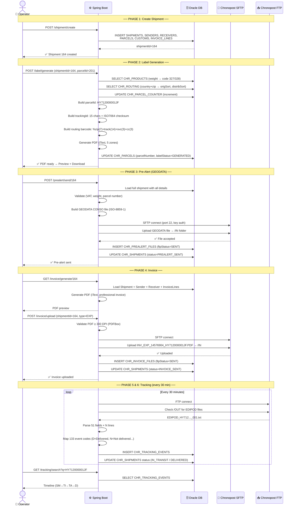
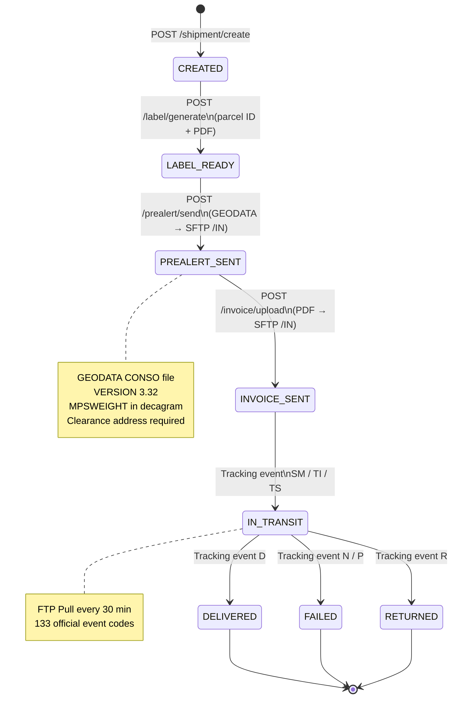
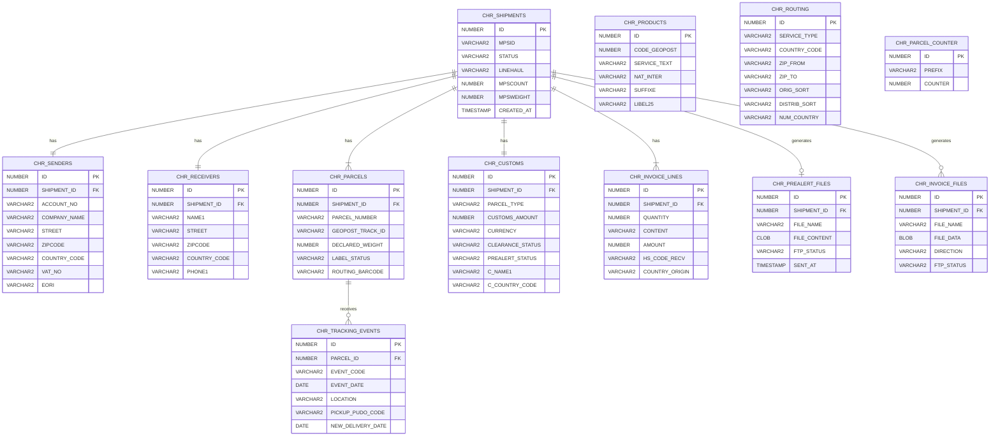
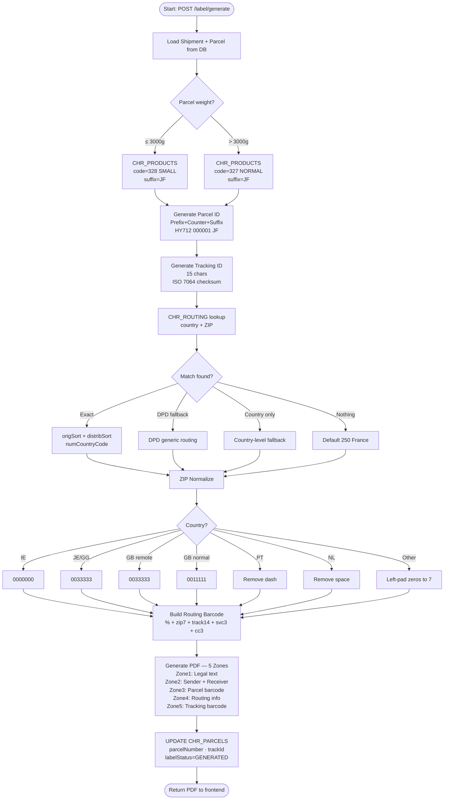
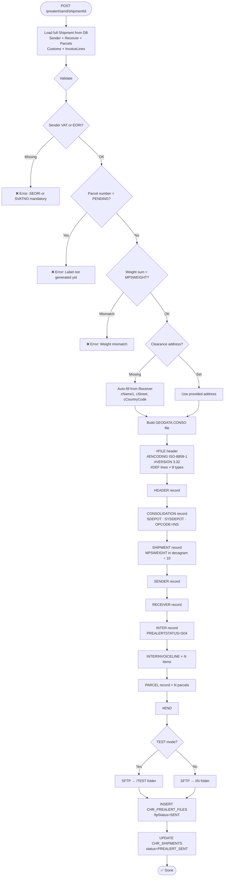
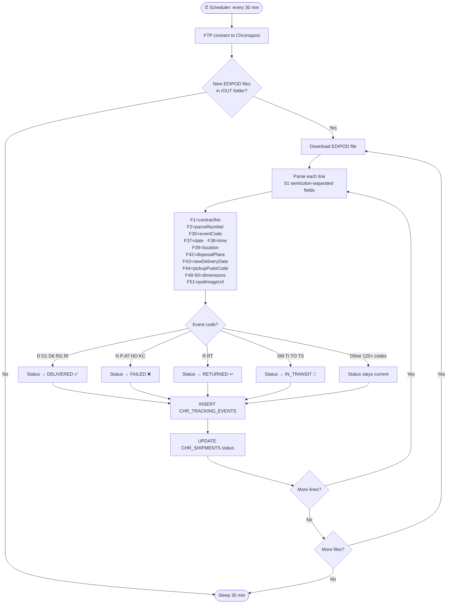

# Chronopost Integration — All Diagrams

---

## 1. Sequence Diagram — Complete Flow

---

## 2. State Diagram — Shipment Status

---

## 3. ER Diagram — Database Schema

---

## 4. Flowchart — Label Generation Logic

---

## 5. Flowchart — GEODATA Pre-Alert

---

## 6. Flowchart — Tracking Pull (Scheduler)

---

## 7. Component Architecture

```mermaid
graph TB
    subgraph Frontend["🖥️ React 18 Frontend"]
        SL[ShipmentListPage]
        SD[ShipmentDetailPage]
        NS[NewShipmentPage]
        LP[LabelPage]
        PA[PreAlertPage]
        IP[InvoicePage]
        TP[TrackingPage]
        PP[ProductsPage]
        RP[RoutingLookupPage]
    end

    subgraph Backend["⚙️ Spring Boot 3.2 Backend"]
        subgraph Controllers
            SC[ShipmentController]
            LC[LabelController]
            PC[PreAlertController]
            IC[InvoiceController]
            TC[TrackingController]
            AC[AdminController]
        end

        subgraph Services
            SS[ShipmentService]
            LS[LabelService]
            PS[PreAlertService]
            IS[InvoiceService]
            TS[TrackingService]
        end

        subgraph Generators
            LG[LabelPdfGenerator]
            IG[CommercialInvoicePdfGenerator]
            GB[GeoDataFileBuilder]
            BC[BarcodeImageGenerator]
            RC[RoutingCalculator]
            ZN[ZipCodeNormalizer]
            TG[TrackingIdGenerator]
            PG[ParcelIdGenerator]
        end

        subgraph External
            SFTP[SftpService\nJSch port 22]
            SCHED[TrackingScheduler\n30 min interval]
            ISCH[InvoiceScheduler\n30 min interval]
        end
    end

    subgraph DB["🗄️ Oracle 11g"]
        T1[(CHR_SHIPMENTS)]
        T2[(CHR_PARCELS)]
        T3[(CHR_ROUTING\n417K rows)]
        T4[(CHR_PRODUCTS)]
        T5[(CHR_TRACKING_EVENTS)]
    end

    subgraph Chronopost["🚚 Chronopost France"]
        SFTP_IN[SFTP /IN\nGEODATA + Invoice]
        FTP_OUT[FTP /OUT\nEDIPOD tracking]
    end

    SL & SD & NS --> SC
    LP --> LC
    PA --> PC
    IP --> IC
    TP --> TC
    PP & RP --> AC

    SC --> SS
    LC --> LS
    PC --> PS
    IC --> IS
    TC --> TS

    LS --> LG & RC & ZN & TG & PG
    IS --> IG
    PS --> GB & SFTP
    TS --> SCHED

    SS & LS & PS & IS & TS --> T1 & T2
    LS --> T3 & T4
    TS --> T5

    SFTP --> SFTP_IN
    SCHED --> FTP_OUT
    ISCH --> SFTP_IN
```

---

## Summary Table

| Diagram | বিষয় |
|---------|------|
| 1. Sequence | কে কাকে কখন call করে |
| 2. State | Shipment কীভাবে status বদলায় |
| 3. ER | DB table-এর সম্পর্ক |
| 4. Flowchart | Label কীভাবে তৈরি হয় |
| 5. Flowchart | GEODATA কীভাবে তৈরি হয় |
| 6. Flowchart | Tracking কীভাবে pull হয় |
| 7. Architecture | সব component-এর সম্পর্ক |

> **Render করতে:** GitHub, GitLab, Obsidian, Notion, বা [mermaid.live](https://mermaid.live)-এ paste করো।
