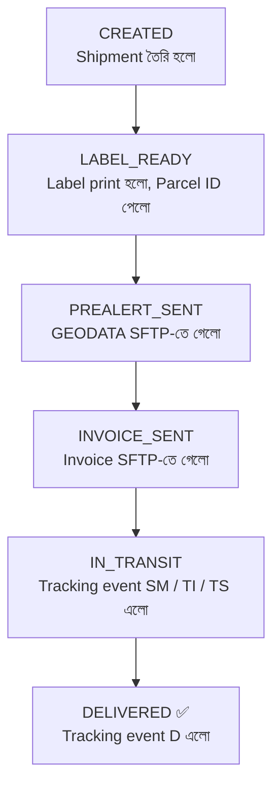

# 🚚 Chronopost Integration — One Page Overview

## **মানুষের কাজ শুধু ৪টা click**
### 1️⃣ New Shipment তৈরি করো  
### 2️⃣ Label print করো  
### 3️⃣ Pre-Alert পাঠাও  
### 4️⃣ Invoice পাঠাও  

## **বাকি সব automatic** ⚙️

---

## 🔄 End-to-End Flow

---

## 📱 App কী করে

<table>
<tr>
<td width="50%" valign="top">

### 📤 PUSH  
**App → Chronopost SFTP `/IN`**

- 📡 **GEODATA file**  
  → parcel আসছে জানায়  

- 📋 **Invoice PDF**  
  → customs-এর জন্য পাঠায়  

</td>
<td width="50%" valign="top">

### 📥 PULL  
**App ← Chronopost FTP**  
**প্রতি ৩০ মিনিটে**

- 📍 **Tracking events**  
  → parcel কোথায় আছে জানায়  

- 📄 **Invoice copy**  
  → Chronopost-এর কাছ থেকে আনে  

</td>
</tr>
</table>

---

## 🧭 Status কীভাবে বদলায়

| Step | Status | Meaning |
|---|---|---|
| 1 | **CREATED** | shipment তৈরি হয়েছে |
| 2 | **LABEL_READY** | label print হয়েছে, parcel ID পাওয়া গেছে |
| 3 | **PREALERT_SENT** | GEODATA SFTP-তে গেছে |
| 4 | **INVOICE_SENT** | invoice SFTP-তে গেছে |
| 5 | **IN_TRANSIT** | tracking event `SM / TI / TS` এসেছে |
| 6 | **DELIVERED ✅** | tracking event `D` এসেছে |

---

## 📂 কে কী file পাঠায়

| File | কে বানায় | কোথায় যায় |
|---|---|---|
| **GEODATA** | App | **Chronopost SFTP `/IN`** |
| **Invoice PDF** | App | **Chronopost SFTP `/IN`** |
| **EDI / POD / Invoice Copy** | Chronopost | **FTP → App নিয়ে আসে** |

---

## 🗃️ DB-তে ১২টা table — কোনটা কখন লাগে

### 🟦 Shipment তৈরিতে
- `SHIPMENTS`
- `SENDERS`
- `RECEIVERS`
- `PARCELS`
- `CUSTOMS`
- `INVOICE_LINES`

### 🟨 Label-এ
- `PARCELS` *(update)*
- `PARCEL_COUNTER`
- `PRODUCTS`
- `ROUTING` *(lookup)*

### 🟪 Pre-Alert-এ
- `PREALERT_FILES`

### 🟧 Invoice-এ
- `INVOICE_FILES`

### 🟩 Tracking-এ
- `TRACKING_EVENTS`
- `SHIPMENTS` *(status update)*

---

## ✅ এক লাইনে summary

**মানুষ শুধু shipment create, label print, pre-alert send, আর invoice send করবে — এর পর file exchange, tracking pull, এবং status update সব system automatic handle করবে।**
