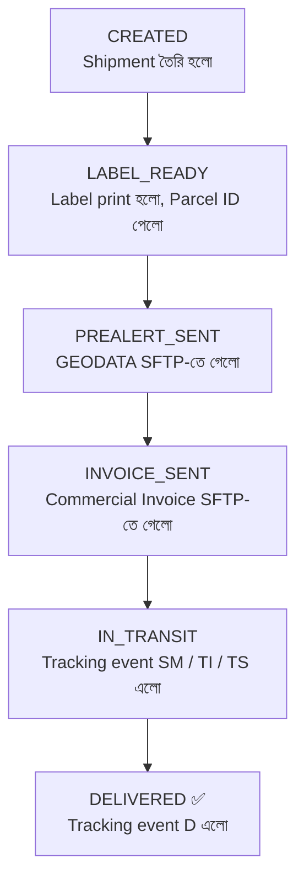

# 🚚 Chronopost Integration — One Page Overview

## **মানুষের কাজ শুধু ৪টা click**
### 1️⃣ New Shipment তৈরি করো  
### 2️⃣ Label print করো  
### 3️⃣ Pre-Alert পাঠাও  
### 4️⃣ Invoice পাঠাও  

## **বাকি সব automatic** ⚙️

---

## 🔄 End-to-End Flow

---

## 📱 App কী করে

<table>
<tr>
<td width="50%" valign="top">

### 📤 PUSH  
**App → Chronopost SFTP `/IN`**

- 📡 **GEODATA file**  
  → parcel আসছে জানায়  

- 📋 **Commercial Invoice PDF**  
  → customs clearance-এর জন্য পাঠায়  

</td>
<td width="50%" valign="top">

### 📥 PULL  
**App ← Chronopost FTP / SFTP `/OUT`**  
**প্রতি ৩০ মিনিটে**

- 📍 **Tracking events**  
  → parcel কোথায় আছে জানায়  

- 📄 **Import / Customs Invoice copy**  
  → Chronopost / Belgium customs-এর কাছ থেকে আনে  

</td>
</tr>
</table>

---

## 🧾 Invoice-এর দুই দিক

### 1) তুমি পাঠাও (**Export Invoice**)
- তুমি **commercial invoice** বানাও
- সেটা **Chronopost SFTP `/IN`**-এ দাও
- Chronopost সেটা নিয়ে **customs clearance** process করে

**Example:**  
`INV_EXP_14576904_HY712000001JF.PDF`  
→ এটা **তোমার commercial invoice**

### 2) Chronopost পাঠায় (**Import Invoice**)
- যখন parcel **Belgium**-এ পৌঁছায়, সেখানে customs **duty / tax calculate** করে
- তারপর একটি **customs invoice** বানানো হয়
- Chronopost সেটা **SFTP `/OUT`**-এ রেখে দেয়
- তোমার app **প্রতি ৩০ মিনিটে pull** করে নিয়ে আসে

**Example:**  
`INV_IMP_14576904_HY712000001JF.PDF`  
→ এটা **Belgium customs-এর invoice**

---

## ❓ কেন Chronopost invoice পাঠায়?

যখন parcel Belgium-এ পৌঁছায়, তখন সেখানকার customs duty / tax হিসাব করে একটি **customs invoice** তৈরি করে।  
এই invoice তোমার **records, reconciliation, এবং reference**-এর জন্য দরকার হতে পারে।

---

## 🧭 Status কীভাবে বদলায়

| Step | Status | Meaning |
|---|---|---|
| 1 | **CREATED** | shipment তৈরি হয়েছে |
| 2 | **LABEL_READY** | label print হয়েছে, parcel ID পাওয়া গেছে |
| 3 | **PREALERT_SENT** | GEODATA SFTP-তে গেছে |
| 4 | **INVOICE_SENT** | commercial invoice SFTP-তে গেছে |
| 5 | **IN_TRANSIT** | tracking event `SM / TI / TS` এসেছে |
| 6 | **DELIVERED ✅** | tracking event `D` এসেছে |

---

## 📂 কে কী file পাঠায়

| File | কে বানায় | কোথায় যায় |
|---|---|---|
| **GEODATA** | App | **Chronopost SFTP `/IN`** |
| **Commercial Invoice PDF** | App | **Chronopost SFTP `/IN`** |
| **Tracking Events** | Chronopost | **FTP / `/OUT` → App pull করে** |
| **Import / Customs Invoice PDF** | Chronopost / Belgium customs | **SFTP `/OUT` → App pull করে** |

---

## 🗃️ DB-তে ১২টা table — কোনটা কখন লাগে

### 🟦 Shipment তৈরিতে
- `SHIPMENTS`
- `SENDERS`
- `RECEIVERS`
- `PARCELS`
- `CUSTOMS`
- `INVOICE_LINES`

### 🟨 Label-এ
- `PARCELS` *(update)*
- `PARCEL_COUNTER`
- `PRODUCTS`
- `ROUTING` *(lookup)*

### 🟪 Pre-Alert-এ
- `PREALERT_FILES`

### 🟧 Invoice-এ
- `INVOICE_FILES`

### 🟩 Tracking-এ
- `TRACKING_EVENTS`
- `SHIPMENTS` *(status update)*

---

## 🚦 First Go-Live-এ কী mandatory, কী optional

### ✅ এখন যেটা অবশ্যই দরকার
- **তুমি → Chronopost:** `GEODATA + Commercial Invoice`
- **Chronopost → তুমি:** `Tracking Events`

### 🟨 যেটা feature হিসেবে আছে, কিন্তু first go-live-এ লাগতেই হবে এমন না
- **Chronopost → তুমি:** `Import / Customs Invoice pull`

> বাস্তব কথা: শুরুতে **Import invoice** নাও আসতে পারে।  
> এটা নির্ভর করবে **Chronopost-এর সাথে contract / agreed scope**-এ এই অংশ আছে কি না তার উপর।

---

## ✅ এক লাইনে summary

**মানুষ শুধু shipment create, label print, pre-alert send, আর commercial invoice send করবে — এর পর file exchange, tracking pull, এবং status update system automatic handle করবে। Import/customs invoice pull feature আছে, কিন্তু first go-live-এ optional হতে পারে।**
